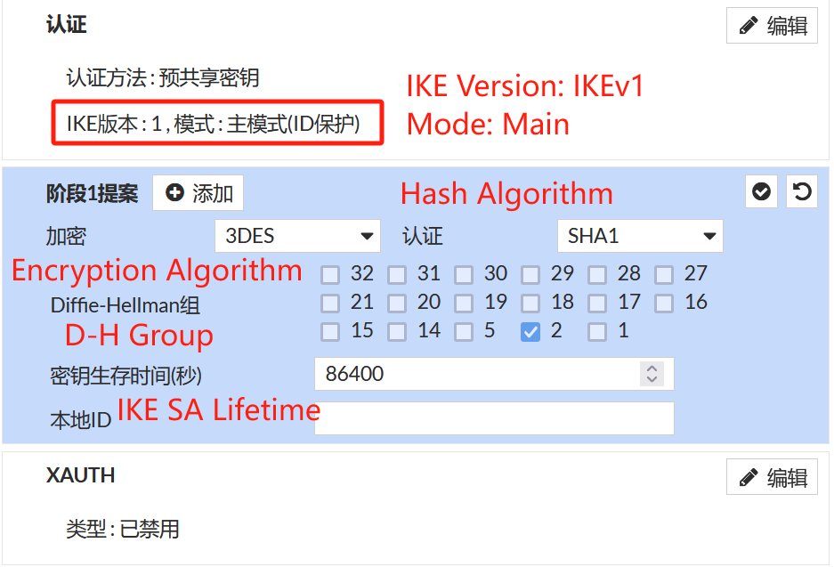
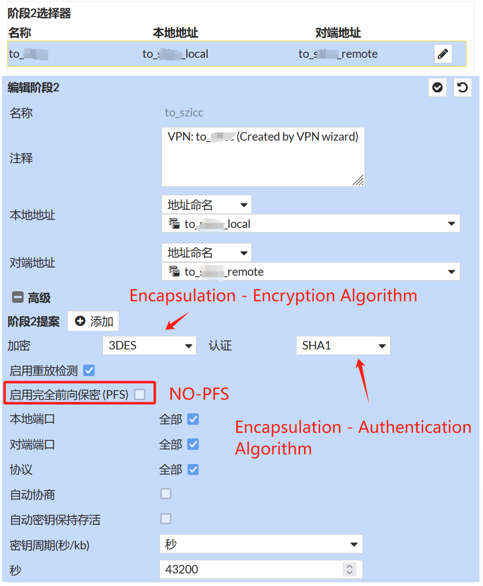

# 网络故障排除


本文记录网络故障排除，以备今后遇到同样问题时，快速解决。


## 交换机Telnet、SSH 无法登录奇怪故障一例

交换机上配置了 `Vlanif 9` - `10.12.9.250/24`、`Vlanif 10` - `10.12.10.250/24`, 想要通过 `10.12.10.0/23` 网段上的终端，通过 SSH/TELNET 登录交换机，交换机上 SSH/TELNET 配置已配置妥当，但无论是通过 SSH, 还是 TELNET 都无法连接上 `10.12.9.250/24`，不过可通过 `10.12.10.250/24` 可以连接上。为何会这样呢？

这是由于发起 SSH/TELNET 的数据包，是交换机上 `Vlanif 9` 收到的，但返回的数据包，则是从 `Vlanif 10` 发出的，那么就造成了混乱，导致 SSH/TELNET 连接无法建立。

## 光模块起不来的问题


光模块起不来，通常是因为所使用的光模块，与光纤不匹配的原因造成。其中，多模光模块使用 810nm 波长的激光，而单模光模块则使用 1310nm 波长的激光。有关单模与多模的区别，请参考：[Fiber Optic Cable Types: Single Mode vs Multimode Fiber Cable](https://community.fs.com/article/single-mode-cabling-cost-vs-multimode-cabling-cost.html)。排查此问题的三个命令（H3C）:


- `display transceiver interface Ten-GigabitEthernet 1/0/52`


输出：


```console
[xfoss-com-core]display transceiver interface Ten-GigabitEthernet 1/0/52
Ten-GigabitEthernet1/0/52 transceiver information:
  Transceiver Type              : 10G_BASE_SR_SFP
  Connector Type                : LC
  Wavelength(nm)                : 850
  Transfer Distance(m)          : 80(OM2),30(OM1),300(OM3)
  Digital Diagnostic Monitoring : YES
  Vendor Name                   : XFOSS-COM
  Vendor Part Number            : SFPXG-850C-D30
  Part Number                   : SFPXG-850C-D30
  Serial Number                 : 012345678901
```

- `display transceiver manuinfo interface Ten-GigabitEthernet 1/0/52`


输出：


```console
[xfoss-com-core]display transceiver manuinfo interface Ten-GigabitEthernet 1/0/51
Ten-GigabitEthernet1/0/51 transceiver manufacture information:
  Manu. Serial Number : 01234567890123456789
  Manufacturing Date  : 2017-04-01
  Vendor Name         : XFOSS-COM
```


- `display transceiver diagnosis interface Ten-GigabitEthernet 1/0/51` 

输出：


```console
[xfoss-com-core]display transceiver diagnosis interface Ten-GigabitEthernet 1/0/51
Ten-GigabitEthernet1/0/51 transceiver diagnostic information:
  Current diagnostic parameters:
    Temp.(C) Voltage(V)  Bias(mA)  RX power(dBm)  TX power(dBm)
    42         3.41        6.42      -2.55          -2.71
  Alarm thresholds:
          Temp.(C) Voltage(V)  Bias(mA)  RX power(dBm)  TX power(dBm)
    High  80         3.60        15.00     0.00           0.00
    Low   -15        3.00        0.00      -10.90         -8.30
```


- `display transceiver alarm interface Ten-GigabitEthernet 1/0/52`


输出：


```console
[xfoss-com-core]display transceiver alarm interface Ten-GigabitEthernet 1/0/52
Ten-GigabitEthernet1/0/52 transceiver current alarm information:
  RX power low
  RX signal loss
```


## H3C IPv6 DHCP snooping 设置

此问题源起 [Windows DNS 解析异常的一种情况](https://snippets.xfoss.com/36_Win_SysAdmin.html#windows-dns-%E8%A7%A3%E6%9E%90%E5%BC%82%E5%B8%B8%E7%9A%84%E4%B8%80%E7%A7%8D%E6%83%85%E5%86%B5)，排查发现在防火墙（FortiGate 60E）上已经禁用 IPv6，故分析主机获取到的局域网IPv6地址，是从交换机上得到。但继续排查发现核心交换机同样没有启用 IPv6 栈，那么就可能是网络上有具备 IPv6 DHCP 功能的设备，给主机了局域网的 IPv6 地址，以及 IPv6 DNS 服务器。

尝试在核心交换机上开启 IPv6 DHCP snooping 功能：


```console
ipv6 dhcp snooping enable
```


并在接入接口上，开启 IPv6 DHCP snooping 功能，已消除上述设备 IPv6 DHCP 功能的影响：


```console
interface GigabitEthernet1/0/1
 port link-mode bridge
 port access vlan 10
 ipv6 dhcp snooping deny
```


随后发现，终端主机已经没有获取到 IPv6 DNS server 了。Windows DNS 解析异常问题解除。


*注*：H3C 交换机建立端口组的命令为：`interface range name acc`，其中 `acc` 为端口组的名字，命令后跟要加入该端口组的接口。


## FG 防火墙问题


本小节记录网络设备 FG 防火墙的有关问题。


### SSLVPN 中策略放行但某个网段下主机不通问题


这是因为 FG 中 SSLVPN 下，还有路由的设置，通过这个设置，控制了 SSLVPN 拨号进来的用户，总体上可以访问哪些网段。设置位于

`VPN --> SSL-VPN 门户 --> full-access --> 隧道分割 --> 隧道分离地址`


若在此设置中未加入某个网段，那么即使在 “策略” 中放行了这个网段中的某些主机，SSLVPN 拨入的用户也仍然不能连接到这些主机。同时 SSLVPN 拨号的终端上，也不会有到这个网段的路由条目（加入到隧道分离地址中的网段，在拨号终端的路由表中是有对应的路由条目的）。


### IPSec 隧道下站点 B 无法访问站点 A 特定子网问题


站点 B 可以访问到站点 A 的 `10.11.1.0/24` 子网，但无法访问到 `10.11.2.0/24` 子网，检查站点 B 上已设置正确的路由，站点 A 上也放行了 IPSec 隧道对 `10.11.2.0/24` 子网的访问。

随后联系 FG 官方支持工程师对此问题进行排查，发现是策略配置错误导致。`10.11.1.0/24` 和 `10.11.2.0/24` 两个子网，是配置在 FG 60E 防火墙的两个不同 internal 接口上，而原先的策略配置，把 IPSec 隧道对 `10.11.2.0/24` 子网的访问放行，与对 `10.11.1.0/24` 子网的放行，一并放在了 `10.11.1.0/24` 所在接口上，由此造成站点 B 对 `10.11.2.0/24` 子网的访问不通。


**解决方法**：在 Site A 的 FG 防火墙上，把 IPSec 隧道对 `10.11.2.0/24` 网段的访问放行策略，建立在 `10.11.2.0/24` 子网所对应的接口上。


### IPSec 隧道建立问题


- 建立 “接口模式” IPSec 隧道时，务必要选择物理接口，否则会报错；

- ~~特性（“Feature”）版本下，无法在网页 GUI 界面下修改IPSEC VPN 配置；成熟版本下可以~~，选择“转换未自定义隧道”后就可以了。


### “自定义” 隧道下参数配置


在不同企业、对端为非 FG 防火墙的如下 IPSec 隧道参数约定下，FG 端的配置如下面的截图所示。


```text
Phase 1 Proposal:
    IKE Version:				IKEv1
    Authentication Method:  	Preshared
    Preshared Key:			    somekey(根据客户不同进行事先协商确定)
    DH Group:				    Group 2
    Encryption Algorithm:		3DES-CBC
    Hash Algorithm:			    SHA-1
    IKE SA Lifetime:     	    480 Mins
    Mode:					    Main

Phase 2 Proposal:
    Perfect Forward Secrecy:	NO-PFS
    Encapsulation:
        Encryption (ESP)
            Encryption Algorithm:		3DES-CBC
            Authentication Algorithm:	SHA-1
    IPSEC Tunnel Lifetime:		60 Mins
```


*图 1、阶段 1 认证方法*


*图 2、阶段 1 参数*




*图 3、阶段 2 参数*


